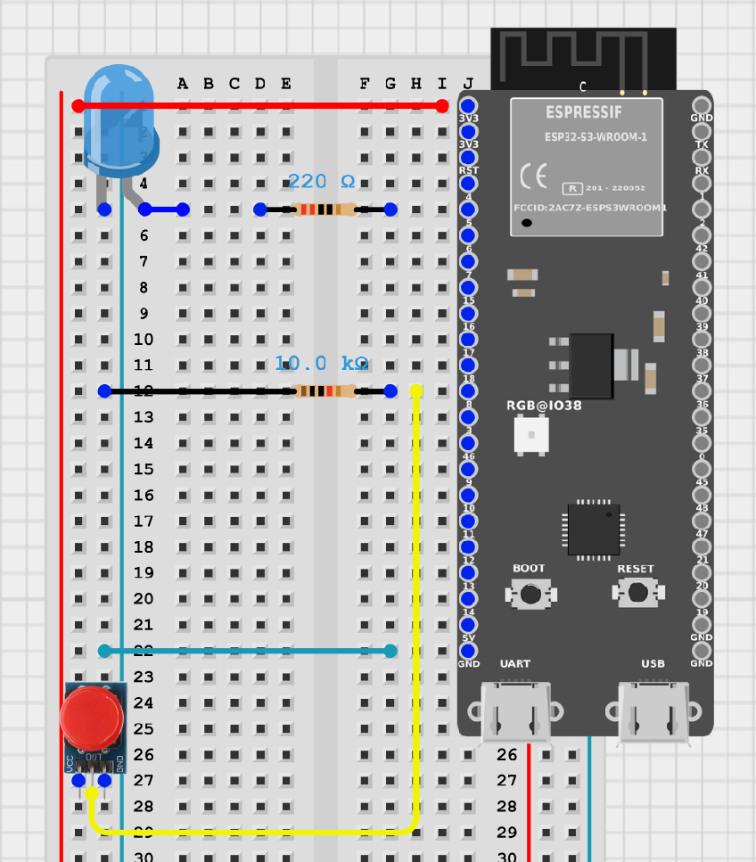

# ESP32 Blink - Learning Project

This is a small educational project for the [Embedded Development course](https://beetroot.academy/courses/online/kurs-embedded-development)

## Task
The goal of this task was to rebuild the classic Arduino Blink as a clean Embedded C++ app for ESP32.

Implemented concepts:
- non-blocking superloop architecture (no delay)
- state-driven LED control with enum class
- compile-time configuration via constexpr/static const
- button handling through hardware interrupt (attachInterrupt)
- minimal ISR with volatile event flag and main-loop processing
- mode switching on button press: Blink -> Always On -> Always Off -> Blink
- simple software debounce in loop and loop timing measurements

## Circuit Diagram

## Result

If GIF preview is not displayed in your viewer, open it directly: [result.gif](./result.gif)
